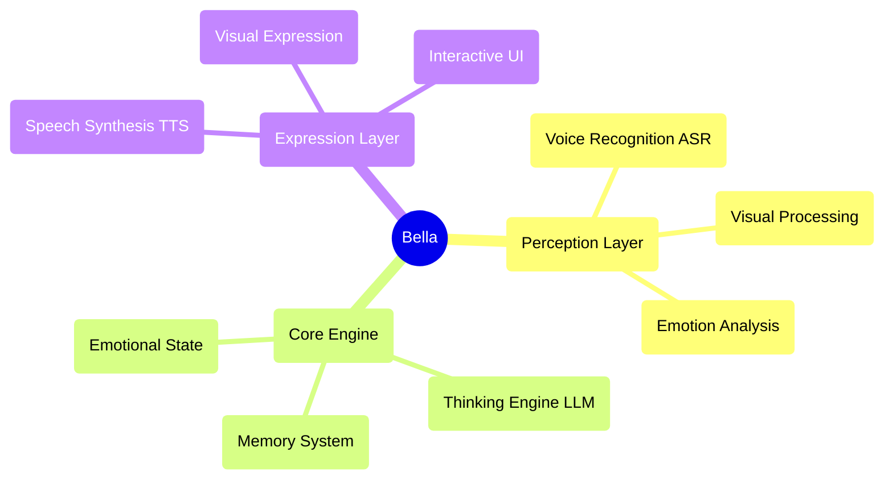

<div align="center">
  
  
  # Bella AI
  
  **Your digital companion, awakening now** ✨
  
  [](https://opensource.org/licenses/MIT)
  [](https://nodejs.org/)
  []()
  
</div>

---

## 🚀 Quick Start

### One-Click Launch
```bash
# Clone the project
git clone https://github.com/GRISHM7890/Bella.git
cd Bella

# Install dependencies
npm install

# Download AI models
npm run download

# Start the service
npm start
```

Visit `http://localhost:8081` to start communicating with Bella!

### System Requirements
- Node.js 22.16.0+
- Modern browser (supporting Web Speech API)
- Microphone permissions (for voice interaction)

---

## 💫 Project Vision

Imagine a digital friend who is always by your side, evolving and growing with you. This is Bella's ultimate vision. We're not just building features; we're nurturing a "personality." A digital life that will transcend the screen and become a meaningful part of your world.

Bella is not just an application; she is the seed of a digital companion. In this rapidly changing digital world, Bella represents a profound dream—a lasting, personalized presence, designed to one day accompany you, listen to you, and see the world through your eyes.

---

## 🎯 Current Feature Status

### ✅ Implemented Features
- **🎤 Voice Perception**: Voice recognition based on Whisper ASR
- **🎬 Visual Expression**: Multiple video random playback with elegant cross-fading
- **🎨 User Interface**: Elegant interaction interface and loading animations
- **⚙️ AI Core Architecture**: Singleton pattern BellaAI class and modular design
- **🌐 Web Service**: HTTP server, CORS support, one-click startup
- **📱 Responsive Design**: Elegant interface adapting to different screen sizes
- **🔧 Model Management**: Automatic download and management of AI models
- **💝 Basic Interaction**: Affinity system and emotional feedback
- **🧠 Enhanced LLM Dialogue**: Optimized prompt engineering and parameter configuration for more natural, Siri-like conversations

### 🔧 Technology Ready for Activation
- **🧠 Thinking Engine**: LLM integration framework ready, supporting multiple models
- **🗣️ Speech Synthesis**: TTS model downloaded and ready for activation
- **💝 Emotional State System**: Basic infrastructure built, supporting emotional analysis

### 📋 Planned Features
- **🧠 Memory System**: Long-term and short-term memory management
- **👁️ Facial Perception**: Expression recognition and emotional analysis
- **🤝 Advanced Interaction**: Multimodal interaction and personalized responses
- **🌟 Active Companionship**: Intent prediction and proactive care
- **🎭 Dynamic Personality**: AI-based personalized personality model
- **🔄 Self-Evolution**: Continuous learning and growth mechanisms

---

## 🏗️ Technical Architecture

### Core Design Principles
- **AI Native**: AI is not a tool, but the blueprint for Bella's mind
- **Modular Design**: Highly decoupled component architecture
- **Elegant Implementation**: Code as art, pursuing simplicity and aesthetics
- **Emotion-Driven**: Product design centered on emotional connection

### Architecture Diagram


### Technology Stack
- **Frontend**: Native JavaScript + CSS3 + HTML5
- **Backend**: Node.js + Express
- **AI Models**: Whisper (ASR) + Local LLM + TTS
- **Architecture Patterns**: Event-driven + Singleton Pattern + Modular Design

---

## 📁 Project Structure

```
Bella/
├── 📄 index.html          # Main page
├── 🎨 style.css           # Style file
├── ⚡ main.js             # Main logic
├── 🧠 core.js             # AI core engine
├── 📜 script.js           # Interaction script
├── 🔧 download_models.js  # Model download tool
├── 📦 package.json        # Project configuration
├── 📚 models/             # AI model directory
├── 🔌 providers/          # AI service providers
├── 📹 videos/             # Visual resources
├── 📋 PRD.md              # Product requirements document
├── 📝 Features.md         # Feature list
└── 📊 Development.md      # Development plan
```

---

# Guía de Solución de Problemas para la Instalación en Windows

¡Hola! Si has encontrado problemas al intentar instalar y ejecutar a Bella en un entorno Windows, no te preocupes. Esta guía recopila una serie de errores comunes y sus soluciones paso a paso para asegurar que tengas una instalación exitosa.

## Resumen de Problemas Comunes

La instalación puede fallar por varias razones que no son evidentes en la guía de inicio rápido. Los problemas más comunes son:

1.  **Error de `git clone` (código 129)** debido a que Git no está correctamente configurado en el PATH del sistema.
2.  **Error de `git clone` ("Too many arguments")** causado por espacios en la ruta del directorio del proyecto.
3.  **Error de `git clone` ("post-checkout hook")** debido a las protecciones de seguridad de versiones recientes de Git.
4.  **Error del servidor `404: "Not found"`** al iniciar la aplicación.
5.  **Error del servidor `EADDRINUSE`** (dirección ya en uso) al intentar iniciar el servidor.

---

## Solución Paso a Paso

Sigue esta secuencia para diagnosticar y resolver tu problema.

### Problema 1: `npm run download` falla con un error de `git` (código 129)

Si al ejecutar `npm run download` la consola muestra un error con `code: 129` y un montón de texto de ayuda de Git, significa que Node.js no puede encontrar el programa `git.exe`.

**Solución: Instalar/Reinstalar Git correctamente.**

1.  **Descarga Git:** Ve a la [página oficial de Git](https://git-scm.com/download/win ) y descarga el instalador para Windows.
2.  **Instala Git:** Ejecuta el instalador. Durante el proceso, asegúrate de seleccionar la opción recomendada: **"Git from the command line and also from 3rd-party software"**. Esto añade Git a la variable de entorno `PATH` del sistema, permitiendo que otras aplicaciones como VS Code lo encuentren.
3.  **Reinicia tu terminal:** Cierra completamente Visual Studio Code y cualquier otra terminal que tuvieras abierta.
4.  **Verifica la instalación:** Abre una nueva terminal en la carpeta de tu proyecto y ejecuta `git --version`. Si te devuelve un número de versión, ¡el problema está resuelto!

### Problema 2: `npm run download` falla con el error "fatal: Too many arguments"

Este error ocurre si la ruta a la carpeta de tu proyecto contiene espacios (por ejemplo, `C:\Users\TuUsuario\Desktop\Nueva Carpeta\Bella`). El script de descarga no maneja correctamente estas rutas.

**Solución: Eliminar los espacios de la ruta del proyecto.**

1.  **Cierra VS Code** y cualquier terminal que apunte al proyecto.
2.  **Renombra la carpeta:** Usando el explorador de archivos de Windows, cambia el nombre de la carpeta que contiene espacios. Por ejemplo, renombra `Nueva Carpeta` a `ProyectosDev`.
3.  **Abre el proyecto desde la nueva ruta** en VS Code y continúa desde ahí.

### Problema 3: `npm run download` falla con el error "fatal: active `post-checkout` hook found"

Este es un mecanismo de seguridad de Git que bloquea la ejecución automática de scripts de repositorios remotos. El mensaje de error te informa que, por seguridad, el clonado se ha detenido.

**Solución: Permitir la ejecución del hook de forma segura.**

1.  **Instala `cross-env`:** Esta herramienta nos permite establecer variables de entorno de forma compatible entre sistemas. En tu terminal, ejecuta:
    ```bash
    npm install cross-env --save-dev
    ```
2.  **Modifica `package.json`:** Abre el archivo `package.json` y busca la línea del script `"download"`.
    *   **Original:** `"download": "node download_models.js"`
    *   **Modificada:** `"download": "cross-env GIT_CLONE_PROTECTION_ACTIVE=false node download_models.js"`
3.  **Vuelve a ejecutar la descarga:** Antes de ejecutar, **asegúrate de borrar la carpeta `models`** que pudo quedar a medio crear del intento fallido. Luego, ejecuta `npm run download`.

### Problema 4: El servidor inicia pero la página no carga (Error 404 en consola)

Si el servidor arranca pero en la consola ves errores `GET /" Error (404): "Not found"`, significa que el servidor no encuentra el archivo `index.html`. Esto puede ocurrir por un problema con el script `npm start`.

**Solución: Ejecutar el servidor de forma explícita.**

En lugar de usar `npm start`, utiliza este comando en tu terminal, asegurándote de estar en la carpeta raíz del proyecto:

```bash
npx http-server . -p 8081

